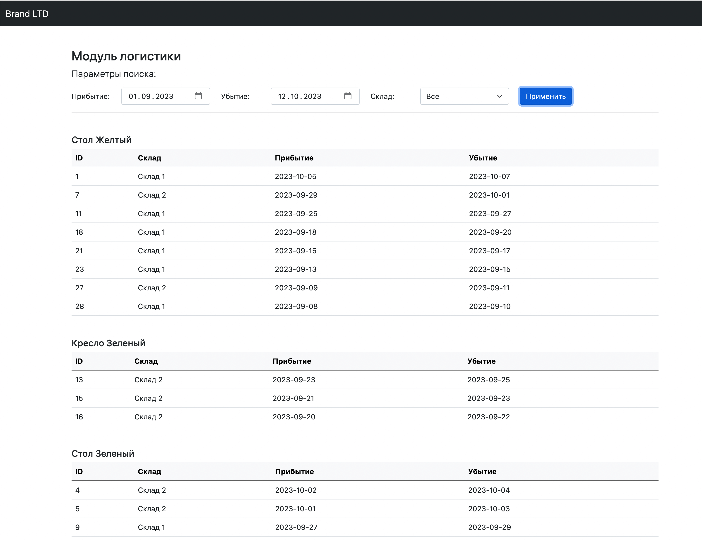
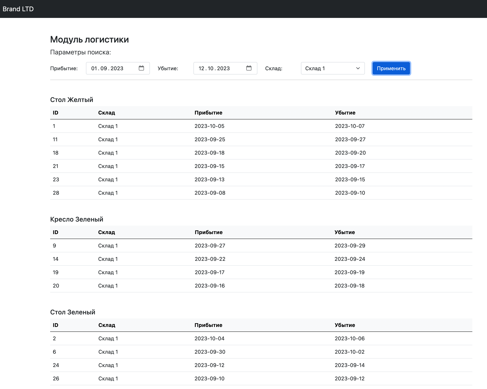
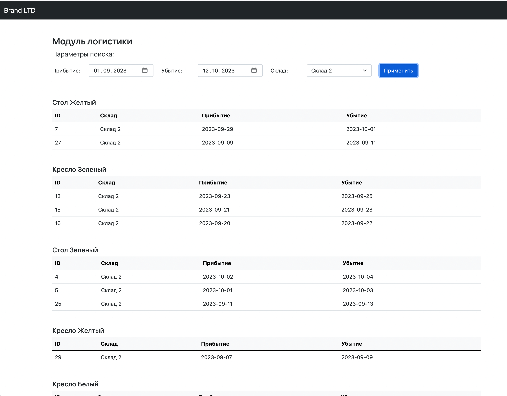
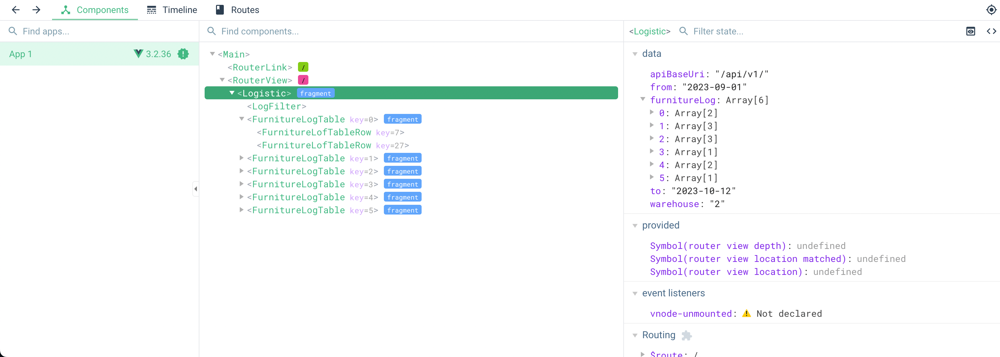

# Логистический модуль

**Порядок запуска:**
- запустить миграции ```php artisan migrate```
- запустить сиды ```php artisan db:seed```
- запустить проект ```npm run dev```

Данные генерируются за последние 30 дней
Основной контроллер API
```API\AvailabilityController.php```

Данные возвращаются через ресурс ```Resources\LogisticResource```

Основная логика фильтрации в ```Models\Logistic```

Пример запроса:
```http://localhost/api/v1/availability?from=2023-09-11&to=2023-10-04&warehouse=2```


В папке ```screens``` скриншоты приложения и развернутые модули из консоли браузера











